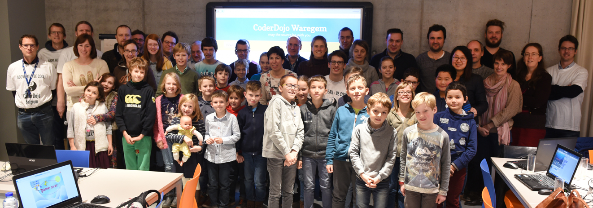

# Welkom bij CoderDojo Waregem

CoderDojo organiseert wereldwijd bijeenkomsten voor jongeren van 7 tot 17 jaar waar ze **in groep leren programmeren**. Ben je minstens 7 jaar en jonger dan 18 jaar? Hou je van computers en zelf (leren) programmeren? Dan is CoderDojo helemaal iets voor jou! Leer alles over programmeren en ga er onmiddellijk mee aan de slag. Geen saaie theorielessen maar **gewoon doen**: spelletjes bedenken, apps ontwikkelen, robots besturen en websites maken. Je hebt helemaal **geen voorkennis nodig**, maar we vragen wel om bij voorkeur een eigen laptop mee te brengen.

Eén zaterdagvoormiddag in de maand organiseert CoderDojo Waregem **gratis workshops** (doe-het-zelf lessen) voor jongens en meisjes van 7 tot 17 jaar. Onze Dojo vind je in de bibliotheek van Waregem en wordt ondersteund door een enthousiast team van coaches: **vrijwilligers** die de workshops voorbereiden en begeleiden. Ze **leggen uit, doen voor, leren aan en stimuleren fantasie, creativiteit en de ontwikkeling van programmeervaardigheden**. Ouders zijn meer dan welkom als ze dat willen. Kinderen tot 12 jaar moeten bij hun eerste deelnames altijd vergezeld zijn van een volwassene.

De regels van CoderDojo zijn heel eenvoudig:

- **regel #1: above all, be cool** — behandel anderen altijd met respect en help elkaar
- **ask 3 before me** — vraag hulp aan deelnemers die naast je zitten, aan dezelfde tafel, aan andere tafels; als niemand de oplossing weet voor je probleem zoek dan hulp bij een coach en deel de oplossing met de anderen aan wie je eerst hulp gevraagd had zodat ze er ook iets van leren
- **speel geen spelletjes die je niet zelf gemaakt hebt** tijdens de CoderDojo
- **coaches coachen** — ze helpen je bij de volgende stappen, geven tips, verklappen truucjes, maar geven niet noodzakelijk kant-en-klare oplossingen voor problemen die opduiken tijdens het programmeren; zo helpen ze je om te leren hoe je zelf problemen kan oplossen; dat is pas cool!
- **CoderDojo organiseert doe-het-zelf lessen** — we zijn geen school! loop rond, vraag aan anderen wat ze aan het doen zijn, en zorg dat je er vooral veel plezier aan beleeft
- laat het aan je ouders weten als je het lokaal moet verlaten
- help de eet-en-drink-stand proper te houden en gooi je afval in de prullenbak

<!--
Video is set to private for some reason

Deel deze [video over CoderDojo](https://youtu.be/7XQOVKd-vVI) met je vrienden en klasgenoten als je hen over CoderDojo wil vertellen.

<iframe width="560" height="315" src="https://www.youtube.com/embed/7XQOVKd-vVI?cc_load_policy=1&hl=nl&cc_lang_pref=nl" frameborder="0" allowfullscreen></iframe>

-->

*"Er worden regelmatig foto's of video's genomen tijdens de Dojo's. Door inschrijving en deelname aan de CoderDojo-activiteiten, gaat U er als ouder of voogd mee akkoord dat er beeldmateriaal kan genomen worden van uw kinderen en dat dit beeldmateriaal kan gebruikt worden voor publicatie in het kader van bekendmaking/marketing van CoderDojo. Indien U hiermee niet akkoord bent, kunt U dit laten weten aan [info@coderdojo-waregem.be](mailto:nfo@coderdojo-waregem.be)."*

## CoderWaar?

[Bibliotheek Waregem](https://www.google.com/maps/place/50%C2%B052'08.0%22N+3%C2%B024'25.0%22E/@50.8688999,3.4063882,19z/data=!3m1!4b1!4m5!3m4!1s0x0:0x0!8m2!3d50.8688999!4d3.4069354?hl=en-GB) 
Boekenplein 1 
8790 Waregem 
email: [info@coderdojo-waregem.be](mailto:nfo@coderdojo-waregem.be)

## CoderWanneer?

Deelname aan CoderDojo Waregem is gratis, maar je moet wel op voorhand inschrijven. Het aantal plaatsen is beperkt: ben je verhinderd om deel te nemen aan een event waarvoor je bent ingeschreven, schrijf je dan terug uit via Eventbrite en maak zo je plaats vrij voor andere geïnteresseerden. Alle plaatsen volzet? Geen nood: teken in op de wachtlijst zodat je automatisch verwittigd wordt als er plaatsen vrijkomen of inschrijvingen openen voor volgende events.

- zaterdag 20 september 2025, 09:30-12:15 ([foto's](https://photos.app.goo.gl/6vi15764rojwVjJg9))
- zaterdag 18 oktober 2025, 09:30-12:15 ([foto's](https://photos.app.goo.gl/64nWQE6JJF6H99Xy6))
- zaterdag 15 november 2025, 09:30-12:15 ([foto's](https://photos.app.goo.gl/s5Rq2c48tr1VpJceA))
- zaterdag 20 december 2025, 09:30-12:15 ([foto's](https://photos.app.goo.gl/78D9r3CYujSGZvzh8))
- zaterdag 17 januari 2026, 09:30-12:15 ([inschrijving](https://www.eventbrite.co.uk/e/registratie-coderdojo-waregem-17012026-1977925464308))
- zaterdag 21 februari 2026, 09:30-12:15 ([inschrijving](https://www.eventbrite.co.uk/e/registratie-coderdojo-waregem-21022026-1979724231469))
- zaterdag 14 maart 2026, 09:30-12:15
- zaterdag 18 april 2026, 09:30-12:15
- zaterdag 23 mei 2026, 09:30-12:15
- zaterdag 20 juni 2026, 09:30-12:15

- zaterdag 21 september 2024, 09:30-12:15 ([foto's](https://photos.app.goo.gl/jCTL2SUJwzKUUx129))
- zaterdag 12 oktober 2024, 09:30-12:15 ([foto's](https://photos.app.goo.gl/4rs7eafwdmrpSPf3A))
- zaterdag 9 november 2024, 09:30-12:15 ([foto's](https://photos.app.goo.gl/cPwhJW9fqcDyzwHk8))
- zaterdag 7 december 2024, 09:30-12:15 ([foto's](https://photos.app.goo.gl/dN1w3rP3zbbvsXrHA))
- zaterdag 18 januari 2025, 09:30-12:15 ([foto's](https://photos.app.goo.gl/v5cSEtVfuRcXHwXd7))
- zaterdag 15 februari 2025, 09:30-12:15 ([foto's](https://photos.app.goo.gl/seDfbJVw2KhFvZp98))
- zaterdag 15 maart 2025, 09:30-12:15 ([foto's](https://photos.app.goo.gl/ng92ZNsRKaa7yyX19))
- zaterdag 19 april 2025, 09:30-12:15 ([foto's](https://photos.app.goo.gl/nRpuUseVpbq2uD6P6))
- zaterdag 10 mei 2025, 09:30-12:15 ([foto's](https://photos.app.goo.gl/DKSWmGCgiKKvWFgZA))
- zaterdag 14 juni 2025, 09:30-12:15 ([foto's](https://photos.app.goo.gl/a3RWhZ4F78VpFRJN6))

- zaterdag 16 september 2023, 09:30-12:15 ([foto's](https://photos.app.goo.gl/o4R6NTcuz9nuuDxYA))
- zaterdag 14 oktober 2023, 09:30-12:15 ([foto's](https://photos.app.goo.gl/yyKbFMUCTQZBCTf2A))
- zaterdag 18 november 2023, 09:30-12:15 ([foto's](https://photos.app.goo.gl/XJ2qKaePxVWKgNUs8))
- zaterdag 16 december 2023, 09:30-12:15 ([foto's](https://photos.app.goo.gl/HLVhGNd2vspDYL4V8))
- zaterdag 20 januari 2024, 09:30-12:15 ([foto's](https://photos.app.goo.gl/KmRWEYcfrFHTE42m7))
- zaterdag 17 februari 2024, 09:30-12:15 ([foto's](https://photos.app.goo.gl/eEVTrkDkttkoygXc6))
- zaterdag 16 maart 2024, 09:30-12:15 ([foto's](https://photos.app.goo.gl/dP5xPp1FkMM6uTYq6))
- zaterdag 20 april 2024, 09:30-12:15 ([foto's](https://photos.app.goo.gl/BxHS5f8K7X66bStQ6))
- zaterdag 18 mei 2024, 09:30-12:15 ([foto's](https://photos.app.goo.gl/Rgwj3iacB57RjWk87))
- zaterdag 15 juni 2024, 09:30-12:15 ([foto's](https://photos.app.goo.gl/27Z6YLZaPEnbBT146))

- zaterdag 24 september 2022, 09:30-12:15 ([foto's](https://photos.app.goo.gl/GcsNqWnG1ui8Tu358))
- zaterdag 15 oktober 2022, 09:30-12:15 ([foto's](https://photos.app.goo.gl/1CWnkvyfemK1dfuz6))
- zaterdag 19 november 2022, 09:30-12:15 ([foto's](https://photos.app.goo.gl/cNKDBnyLSRogMUke9))
- zaterdag 17 december 2022, 09:30-12:15 ([foto's](https://photos.app.goo.gl/Hi5iiyyWKHDRs5AeA))
- zaterdag 21 januari 2023, 09:30-12:15 ([foto's](https://photos.app.goo.gl/rf2jDHTWDHp9mLp68))
- zaterdag 25 februari 2023, 09:30-12:15 ([foto's](https://photos.app.goo.gl/uA3Sh8ob2MQ54BEz7))
- zaterdag 18 maart 2023, 09:30-12:15 ([foto's](https://photos.app.goo.gl/BDatU54sYpHfPChk9))
- zaterdag 15 april 2023, 09:30-12:15 ([foto's](https://photos.app.goo.gl/CAtod9hSvuZRWnqW7))
- zaterdag 13 mei 2023, 09:30-12:15
- zaterdag 17 juni 2023, 09:30-12:15 ([foto's](https://photos.app.goo.gl/maxVAPBtvzPUSEVUA))

- zaterdag 18 september 2021, 09:30-12:15 ([foto's](https://photos.app.goo.gl/1yRdXEMP2bS87jEL8))
- zaterdag 16 oktober 2021, 09:30-12:15 ([foto's](https://photos.app.goo.gl/w1YZV38sSHhhLw1M8))
- zaterdag 20 november 2021, 09:30-12:15 ([foto's](https://photos.app.goo.gl/cVxrdx81pkaJVnD89))
- zaterdag 11 december 2021, 09:30-12:15 ([foto's](https://photos.app.goo.gl/PakXRGjkiLaoszfU9))
- zaterdag 15 januari 2022, 09:30-12:15 ([foto's](https://photos.app.goo.gl/BHhe8F8wK2ogob6dA))
- zaterdag 19 februari 2022, 09:30-12:15 ([foto's](https://photos.app.goo.gl/3HMXkVb4HWq6ANdZ9))
- zaterdag 19 maart 2022, 09:30-12:15 ([foto's](https://photos.app.goo.gl/kHj5FRXLgtsAWSLw5))
- zaterdag 23 april 2022, 09:30-12:15 ([foto's](https://photos.app.goo.gl/YBheTQkZyjXUSpwKA))
- zaterdag 14 mei 2022, 09:30-12:15 ([foto's](https://photos.app.goo.gl/Zn5EfSBEKK64YCqL8))
- zaterdag 18 juni 2022, 09:30-12:15 ([foto's](https://photos.app.goo.gl/xGqXEvmctvnJ8sSF7))

- zaterdag 19 september 2020, 09:30-12:15 ([foto's](https://photos.app.goo.gl/5juEPsQysdRKwWnR9))
- zaterdag 17 oktober 2020, 09:30-12:15 ([foto's](https://photos.app.goo.gl/8V3W59DbHCdKsRHY7))
- zaterdag 21 november 2020, 09:30-12:15 ([foto's](https://photos.app.goo.gl/HrckXVgMojGMbmVPA))
- zaterdag 19 december 2020, 09:30-12:15 ([foto's](https://photos.app.goo.gl/mFLu8sTzodR5Qv518))
- zaterdag 16 januari 2021, 09:30-12:15 ([foto's](https://photos.app.goo.gl/fZyv3WPNxboFgz7T7))
- zaterdag 20 februari 2021, 09:30-12:15 ([foto's](https://photos.app.goo.gl/Wg4v8QvEcAAyT32r5))
- zaterdag 20 maart 2021, 09:30-12:15 ([foto's](https://photos.app.goo.gl/LVsXPkcURvYrpGfj9))
- zaterdag 17 april 2021, 09:30-12:15 ([foto's](https://photos.app.goo.gl/1udqYEwZiFHHSNTz8))
- zaterdag 22 mei 2021, 09:30-12:15 ([foto's](https://photos.app.goo.gl/Yei2NYNesmqLAvSP7))
- zaterdag 19 juni 2021, 09:30-12:15 ([foto's](https://photos.app.goo.gl/84X6iqVbTBSCRB7v6))

- zaterdag 21 september 2019, 09:30-12:30 ([foto's](https://photos.app.goo.gl/LtJKBR6UWt7CMS138))
- zaterdag 19 oktober 2019, 09:30-12:30 ([foto's](https://photos.app.goo.gl/tyh8BREN1uxeDv2x9))
- zaterdag 16 november 2019, 09:30-12:30 ([foto's](https://photos.app.goo.gl/RVhiy9eHEberKTGs7))
- zaterdag 21 december 2019, 09:30-12:30 ([foto's](https://photos.app.goo.gl/cujGuQhT2bKhdpjK6))
- zaterdag 18 januari 2020, 09:30-12:30 ([foto's](https://photos.app.goo.gl/79ajuq89x7zSshQC6))
- zaterdag 15 februari 2020, 09:30-12:30 ([foto's](https://photos.app.goo.gl/3qTt3xPEHDvjYM6D7))
- ~~zaterdag 21 maart 2020, 09:30-12:30~~ (afgelast door die stomme corona)
- zaterdag 18 april 2020, 09:30-12:30 ([foto's](https://photos.app.goo.gl/sXvLM9Q2rpHhBW436))
- zaterdag 9 mei 2020, 09:30-12:30 ([foto's](https://photos.app.goo.gl/pG4tZ4hdmsSU5iwQ9))
- zaterdag 20 juni 2020, 09:30-12:30 ([foto's](https://photos.app.goo.gl/fYGzKZRpYgVzQGtLA))

- zaterdag 15 september 2018, 09:30-12:30
- zaterdag 20 oktober 2018, 09:30-12:30 ([foto's](https://photos.app.goo.gl/ePgR7DzJ81Frtx8PA))
- zaterdag 17 november 2018, 09:30-12:30 ([foto's](https://photos.app.goo.gl/nTzyMuMYweKbufwJA))
- zaterdag 15 december 2018, 09:30-12:30 ([foto's](https://photos.app.goo.gl/FjM9i37hEgrc8XpH8))
- zaterdag 19 januari 2019, 09:30-12:30 ([foto's](https://photos.app.goo.gl/2MCDQQt5Xg4rb3cF9))
- zaterdag 16 februari 2019, 09:30-12:30 ([foto's](https://photos.app.goo.gl/m4v72V77JaR2HfH89))
- zaterdag 16 maart 2019, 09:30-12:30 ([foto's](https://photos.app.goo.gl/yujKkyYasmUm27Db6))
- zaterdag 20 april 2019, 09:30-12:30 ([foto's](https://photos.app.goo.gl/9yksprBtY9STgV3W9))
- zaterdag 18 mei 2019, 09:30-12:30 ([foto's](https://photos.app.goo.gl/NdwUcvzSr2JPRChDA))
- zaterdag 8 juni 2019, 09:30-12:30 ([foto's](https://photos.app.goo.gl/nNDUrnZqypWBXkQY9))

- zaterdag 16 september 2017, 09:30-12:30 ([foto's](https://photos.app.goo.gl/P3EJ5WkFiDO7JoLo2))
- zaterdag 21 oktober 2017, 09:30-12:30 ([foto's](https://photos.app.goo.gl/heT1wVgX1ceHCLnQ2))
- zaterdag 18 november 2017, 09:30-12:30 ([foto's)](https://photos.app.goo.gl/kcAkUb0M532ubsz73)
- zaterdag 16 december 2017, 09:30-12:30 ([foto's)](https://photos.app.goo.gl/kf06D6xB63ZMjKLq1)
- zaterdag 20 januari 2018, 09:30-12:30 ([foto's)](https://photos.app.goo.gl/b52SIc1IsxofZONj1)
- zaterdag 17 februari 2018, 09:30-12:30 ([foto's)](https://photos.app.goo.gl/bBq2qTkZDu8KzBn13)
- zaterdag 17 maart 2018, 09:30-12:30 ([foto's](https://photos.app.goo.gl/me3LMc3WfACfilO53))
- zaterdag 21 april 2018, 09:30-12:30
- zaterdag 19 mei 2018, 09:30-12:30 ([foto's](https://photos.app.goo.gl/W0YVutO7BLKxNnDE3))
- zaterdag 16 juni 2018, 09:30-12:30 ([foto's](https://photos.app.goo.gl/Ug48HZQBcdfrD9Xo6))

- zaterdag 29 oktober 2016, 10:00-13:00 ([foto's](https://goo.gl/photos/b2cYKHVmqAGsx9CW6))
- zaterdag 19 november 2016, 09:00-12:00 ([foto's](https://goo.gl/photos/pbEZzFzpphPArspK7))
- zaterdag 10 december 2016, 09:30-12:30 ([foto's](https://goo.gl/photos/Snwn1t67TA2AWzmo9)) 
- zaterdag 21 januari 2017, 09:30-12:30 ([foto's](https://goo.gl/photos/xDYwve2wtVPbqMZc8)) 
- zaterdag 25 februari 2017, 09:30-12:30 ([foto's](https://goo.gl/photos/DWp7LJLDPDpSbHUk9)) 
- zaterdag 18 maart 2017, 09:30-12:30 ([foto's](https://goo.gl/photos/mB9KpBYMhy9xsQGR9))
- zaterdag 15 april 2017, 09:30-12:30 ([foto's](https://goo.gl/photos/inKkNTPqBPbWQ61j9))
- zaterdag 13 mei 2017, 09:30-12:30 ([foto's](https://goo.gl/photos/SxVawPJARrjQFN356))
- zaterdag 17 juni 2017, 09:30-12:30 ([foto's](https://goo.gl/photos/rHCSh8MN7smQqMzPA))

## CoderKata

**Kata** (型, かた) is een term uit de Japanse zelfverdedigingskunsten en vechtsporten die staat voor een individuele stijloefening met een reeks vastgelegde bewegingen, uitgevoerd tegen 4 tot 8 denkbeeldige tegenstanders die uit verschillende richtingen aanvallen. Het is een gedetailleerde reeks vooraf vastgestelde stoot-, trap- en afweertechnieken, die typisch bestaat uit tientallen zeer uiteenlopende bewegingen en technieken. De gehele kata duurt gewoonlijk zo'n 1 à 2 minuten.

Bij programmeren moet je — net zoals bij zelfverdedigingskunsten en vechtsporten — heel wat verschillende technieken onder de knie krijgen die je op een welbepaalde manier moet combineren om een opdracht uit te voeren. In de CoderDojo leer je deze technieken spelenderwijs beheersen door middel van een onze eigen kata: opdrachten die je op weg helpen. Eenmaal je de technieken onder de knie hebt, ben je in staat om ze vrij toe te passen en te combineren om zelf dingen te gaan bouwen. Dit zijn de kata waar we momenteel aan werken:

- [Hour of Code](https://code.org/learn)
  - [Dance Party](https://code.org/dance)
  - [Star Wars](https://studio.code.org/s/starwarsblocks/stage/1/puzzle/1)
  - [Minecraft](https://studio.code.org/courses/mc/units/1/lessons/1/levels/1?lang=nl-NL)
  - [Angry Birds](https://studio.code.org/hoc/1)
  - [Run Marco / Run Sophia](https://runmarco.allcancode.com)
  - [Frozen](https://code.org/api/hour/begin/frozen)
  - [Moana](https://partners.disney.com/hour-of-code/wayfinding-with-code)
  - [Flappy Bird](https://studio.code.org/flappy/1)
  - Lightbot
    - Download dit bestand ([link](assets/lightbot-codehour.swf)) en open het op deze site ([link](https://ruffle.rs/demo/)) via de knop 'Select File'
- [code.org](https://code.org/)
  - [cursus 1](https://studio.code.org/s/course1)  
  - [cursus 2](https://studio.code.org/s/course2)  
  - [cursus 3](https://studio.code.org/s/course3)  
  - [cursus 4](https://studio.code.org/s/course4)  
- [Scratch Junior](http://www.scratchjr.org/)
  - [Overzicht van de blokken](https://drive.google.com/file/d/0B_FlIjXoGUrScUNtVWNfOHlKWTA/view?usp=sharing&resourcekey=0-VneIarW6lKkxn_4zS6KAsA)
  - [Door de stad rijden](https://drive.google.com/file/d/0B_FlIjXoGUrSdkt1Q2o0MlhpYWs/view?usp=sharing&resourcekey=0-PrKmyKzQae7xzC_69cxeVw)
  - [Dierenrace](https://drive.google.com/file/d/0B_FlIjXoGUrSUWEtbXlJX0Z2Ujg/view?usp=sharing&resourcekey=0--hyLaN6J6Nhvp1HshHwzrQ)
  - [Zonsondergang](https://drive.google.com/file/d/0B_FlIjXoGUrSX0hRbU13dVpMTFE/view?usp=sharing&resourcekey=0-60hZ7fKlEB4Hty5JyZ_EXw)
  - [Opkomst van de maan](https://drive.google.com/file/d/0B_FlIjXoGUrSQ2xxMzhOaHFwYm8/view?usp=sharing&resourcekey=0-l5ccwhV9busaS_lNF-NSmA)
  - [Spookachtig bos](https://drive.google.com/file/d/0B_FlIjXoGUrSUmg1RFdvb3hGZFk/view?usp=sharing&resourcekey=0-aHo3t8EniLAY2VM0u5JyDw)
  - [Dribbelen](https://drive.google.com/file/d/0B_FlIjXoGUrSamRnSkNNRzBmWnc/view?usp=sharing&resourcekey=0-2TKOxBl-i5WphXscMPr1vQ)
  - [Dansfeest](https://drive.google.com/file/d/0B_FlIjXoGUrSY2szUno4cElydWs/view?usp=sharing&resourcekey=0-HC6sHANPdMpx8PPF0ptEYA)
  - [Ontmoeten en begroeten](https://drive.google.com/file/d/0B_FlIjXoGUrSZDJSODlkaEg4dmM/view?usp=sharing&resourcekey=0-FJ62ew2xG8LFdmEtv5rlZA)
  - [Klasgesprek](https://drive.google.com/file/d/0B_FlIjXoGUrSUDdfRlZXTVpVcms/view?usp=sharing&resourcekey=0-OLVmzjdcnkSX6nQSK9yElg)
- [Scratch](http://scratch.mit.edu)
  - [Star Hunter](https://drive.google.com/file/d/0B_FlIjXoGUrSOC1MNzBScnVmUVE/view?usp=sharing&resourcekey=0-FPiHNFB1mymHM-t31ClI2Q)
  - [Kaasjacht](https://drive.google.com/file/d/0B_FlIjXoGUrSNFJyQkdjTEN6UG8/view?usp=sharing&resourcekey=0-iXU6M6v-aomb6KXkobqTzw)
  - [Circle Wars](https://drive.google.com/file/d/0B_FlIjXoGUrScnBQSlZmQW5TN28/view?usp=sharing&resourcekey=0-19F7VsIfuG1DHuyMxb-xgg)
  - [Springende aap](https://drive.google.com/file/d/0B_FlIjXoGUrSR2hVdUY1Yjd2Z28/view?usp=sharing&resourcekey=0-9s0wqIdAoOaqyiq6JPKi0w)
  - [Brokken op de bezem](https://drive.google.com/file/d/0B_FlIjXoGUrScW1VbkhwQkJpUUU/view?usp=sharing&resourcekey=0-snY8jKdidlaeT06Bzx_V7A)
  - [Hondenhapjes](https://drive.google.com/file/d/0B_FlIjXoGUrSQTlrY3dvcXpQMzQ/view?usp=sharing&resourcekey=0-8LxDB8-P4bBNf1Fkt40Gfg)
  - [Gletsjerrace](https://drive.google.com/file/d/0B_FlIjXoGUrSUTZ3RVNQSElnR2c/view?usp=sharing&resourcekey=0-dyiv3Hf4rzuZal8otvwzcQ)
  - [Tropical Tunes](https://drive.google.com/file/d/0B_FlIjXoGUrSYU1wcDU2bkZ0ZjQ/view?usp=sharing&resourcekey=0-MDKzmB2WKXAzI8cl3ZTnUw)
  - [Simon Says](https://drive.google.com/file/d/0B_FlIjXoGUrSTC1sWVBhMDJXdzg/view?usp=sharing&resourcekey=0-xxTvl-y3BO2yj1ZShHVxMA) (voorbeeloplossing: [PDF](https://drive.google.com/open?id=0B_FlIjXoGUrSLVpsd0ZMejlkX0U)/[Scratch](https://scratch.mit.edu/projects/134384127/))
  - bezoek onze [Scratch Studio](https://scratch.mit.edu/studios/3511910/)
- [Scratch For Arduino](http://s4a.cat)
  - [Installatiebestanden](https://drive.google.com/drive/folders/0B9JzX2ePyGz4UXc1NjRLLUoyOFk?resourcekey=0-sjjBIxoLacA-3ZcXTs6WHQ&usp=drive_link)
  - [Parkeergarage - Firmata](assets/snap/Ultrasound_HC_SR04Firmata.ino)
  - [Parkeergarage - Blocks](assets/snap/Ultrasound_HC_SR04_blocks.xml)
- Scratch & Artificiële Intelligentie (AI)
  - stap 1: train je model
    - [Teachable Machine](https://eur03.safelinks.protection.outlook.com/?url=https%3A%2F%2Fteachablemachine.withgoogle.com%2F&data=04%7C01%7CPeter.Dawyndt%40ugent.be%7Cbef7b70a33fb4469562508da01bae5e1%7Cd7811cdeecef496c8f91a1786241b99c%7C1%7C0%7C637824200636798315%7CUnknown%7CTWFpbGZsb3d8eyJWIjoiMC4wLjAwMDAiLCJQIjoiV2luMzIiLCJBTiI6Ik1haWwiLCJXVCI6Mn0%3D%7C3000&sdata=HezCllknHhml%2Bmu23z5D1hNFwRKioQjqKQAm9SyLckw%3D&reserved=0)
  - stap 2: gebruik je model
    - [extensie voor afbeeldingen/geluid](https://champierre.github.io/tm2scratch/)
    - [extensie voor houdingen](https://champierre.github.io/tmpose2scratch/)
- Mbot
  - [Ontwikkelomgeving online](https://ide.mblock.cc/)
  - [Installatieprogramma](http://www.mblock.cc/download/)
  - [Opdrachten](https://drive.google.com/drive/folders/0B0C5fMkcW0HMQXlTZXJGbVZtcXM?resourcekey=0-TQzgq_NBiNDMng49xvOTlg&usp=drive_link)
  - Vlieg expeditie: dansende robots ([uitleg](https://drive.google.com/file/d/0B0C5fMkcW0HMM1dzd0UzWkRqMEU/view?usp=sharing&resourcekey=0-W_2c7SiGUCyOTkkCjooFgA), [Scratch project](https://drive.google.com/file/d/0B0C5fMkcW0HMbG9UTXI3aWdnREk/view?usp=sharing&resourcekey=0--841l21AP8geYqr88nE6PA))
- micro:bit
  - eerste stapjes ([blockly](https://drive.google.com/file/d/0B_FlIjXoGUrSaDlMNk5ZdS00MVE/view?usp=sharing&resourcekey=0-oW8px_X0gCz6N-zETuBWLg), [python](https://drive.google.com/file/d/0B_FlIjXoGUrSTGRPYTdNTXQ2OVk/view?usp=sharing&resourcekey=0-dAHf1Vd_aTG4euq57mX47Q))
  - [ninja:bit](https://drive.google.com/file/d/11gVywUCyb3CfutYT0vQAWILB1tSIDXch/view?usp=sharing)
  - micro:bit op wielen ([Video](assets/IMG_0924.mp4))
  - [mu editor](https://codewith.mu/)
- websites bouwen
  - nanonauten
    - [boek](https://drive.google.com/file/d/14-hUXNWMoX-IiGLeM3km5QOUTt0Zrn7T/view?usp=sharing)
    - [bestanden](http://nano-tips.com/gamebeelden)
  - [Lukas](https://jsfiddle.net/q2ajgrz0/2/show/)
  - [Jens](https://jsfiddle.net/hzag0tk3/show/)
  - [Nikolina](https://jsfiddle.net/168k5uys/2/show/)
  - [Stevan](https://jsfiddle.net/kgb9to0v/show/)
  - [Lena](https://jsfiddle.net/pd09L85v/show/)
  - [Sander](https://jsfiddle.net/zmt05odp/1/show)
  - [Ludovic](https://jsfiddle.net/m35s1hfL/1/show)
  - [Lukas](https://jsfiddle.net/0aydvkhp/show)
  - 2023
    - [Matteo](https://jsfiddle.net/wujog4rL/14/show)
    - [Lars](https://jsfiddle.net/Larsdec/su4o5wz8/1/show)
    - [Yavin](https://jsfiddle.net/G0DL10N/u24np6og/4/show)
    - [Matties](https://jsfiddle.net/cwby2g9x/show)
    - [Raf](https://jsfiddle.net/uLxbotzc/show)
  - 2025
    - [Ylan](https://jsfiddle.net/0w32kjuv)
    - [Sander & Kevin](https://jsfiddle.net/6m0a5dwz/1)
    - [Leyla](https://jsfiddle.net/4qrp71cs)
    - [Peter](https://jsfiddle.net/e312x5zk/1)
    - [Mathis](https://jsfiddle.net/v73z692q)
    - [Imke](https://jsfiddle.net/pkax6c39)
- [tekeningen programmeren met SVG](https://dodona.be/nl/courses/3375/)
- [SVG Viewer](https://www.svgviewer.dev/)
- Dance Party:
  - [Emile](https://studio.code.org/projects/dance/D05NS25pjrLuKwG4ofhnnYofRnyMgHowcfWmFPM79CU)
  - [Jaron](https://studio.code.org/projects/dance/mT_5J3ceoJfanObfkcH0I2e5AwiBF7SQ-TqDXy9-iA0)
  - [Robbe](https://studio.code.org/projects/dance/IAkqCqQ5I525QHMd9hEoL8rnPg_VT2p3dCv9p8OjuRU)
  - [Dymian](https://studio.code.org/projects/dance/-EFq6ASl_BjrZQUPZMwvqInWTLrNNNnYdxfoLRrYZVI)
  - [Jonas](https://studio.code.org/projects/dance/Hexbbi9je2CH-oLu6KQZ8-pFFOErYLRrCXkLe30JBCc)
  - [Eline](https://studio.code.org/projects/dance/YIm_JssSm1DUaYOY62kDNbgGcxXeufCDgb6TlrTveJs)
  - [Eline T](https://studio.code.org/projects/dance/yzwpa299Yojg-dRnxsBi816Qk79UDdv7Dj04921Tasg)
  - [Melanie](https://studio.code.org/projects/dance/UcjozRARna8W6GgIm76ky53Z8kKAvpItdFIWbrChxIY)
- [CodeCombat](https://www.codecombat.com)
- Sonic Pi:
  - [Eigen muziek toevoegen](https://docs.google.com/document/d/1GE21_N0phedrENWMd749h8LsGFzk1rH8CEjnJYI1rAA/edit?usp=sharing)
- Unity
- MIT App Inventor
  - [Van Start met App Inventor](https://drive.google.com/file/d/1lEr8F7WzY2r6y8ER0AvleLPU9h7B2EUJ/view?usp=sharing)
  - [Hallo, Android!](https://drive.google.com/file/d/1dmN9Uqy3eOfg1Q0rKlH9M16gxLXfvVnR/view?usp=sharing)
  - [Botsende bal](https://drive.google.com/file/d/1Hg6iG9xnBoi1hWzkJkn_G5OJTgBgMvvN/view?usp=sharing)
  - [Dierengeluiden](https://drive.google.com/file/d/1ZxoQhYeiVreYOWxYXgWgOVT8frFE_1-0/view?usp=sharing)
  - [Waar is het noorden?](https://drive.google.com/file/d/1V8yawKcHtbL72byvrZvMASP0KnjXsAEb/view?usp=sharing)
  - [Waar is de mol?](https://drive.google.com/file/d/1j-l4kAlYz6s_dwsOuynCl7zouycexUPJ/view?usp=sharing)
  - [Space Invaders](https://drive.google.com/file/d/1lMNDLpzJAex9nHM54W48zp6f9UyunONw/view?usp=sharing)
  - [Getal gokken voor 2 spelers](https://drive.google.com/file/d/1QKTCoFriLWsdN-H6zLj39KBcl3zJyOv_/view?usp=sharing)
- [Scratch met HTTP calls](ide.codeskool.cc)

[Boeken over programmeren voor kinderen/jongeren](http://mijn.bibliotheek.be/list/view/3225) die de bibliotheek van Waregem in haar collectie heeft.

## Coaches en Cooks

Heb je passie voor ICT en beschik je over wat didactische vaardigheden. **Word coach** en help mee jongeren te inspireren en te leren programmeren. Of wil je liever wat logistieke ondersteuning geven om bijvoorbeeld een cake te bakken voor onze snackbar of te helpen zoeken naar sponsors. **Word cook** en help mee onze CoderDojo *up and running* te houden. Contacteer gerust een van onze coaches of cooks voor wat meer uitleg wat er van je verwacht wordt.

**Onze coaches:**

- [Peter Dawyndt](https://github.com/pdawyndt)
- [Mattijs Eggermont](https://github.com/MattijsE)
- Christophe Fauconnier
- [Michel Lambrecht](https://github.com/MichelLambrecht)
- Jan Sabbe
- [Dominiek Vandewalle](https://github.com/DominiekVandewalle)
- [Casper Vermeeren](https://github.com/CasperThePancake)
- Rune Neirynck
- Joris Ducatteeuw

**Onze cook:**

- Bert Vermeulen

Een van onze coaches was in een lyrische bui toen hij het volgende uit zijn pen liet vloeien aan de vooravond van de eerste CoderDojo in Waregem:

> iedere mens, 
> heeft wel een kleine wens
>
> een wens heel stiekem of fijn, 
> een wens ergens opgeslagen in zijn brein
>
> misschien wel een wens om kindjes te leren coderen, 
> hun de kneepjes van het vak aan te leren,
>
> hun eigen games te laten creëren, 
> lang nog voor ze zelfs maar afstuderen
>
> kindjes stimuleren om creatief te zijn, 
> het stimuleren van hun jonge brein
>
> coderdojo Waregem is begonnen, 
> nu maar hopen dat hun creativiteit wordt ontgonnen

## CoderPress

- [Programmeren is kinderspel](assets/20161125_kw.pdf) (Krant van West-Vlaanderen, editie Waregem, vrijdag 25 november 2016)
- [Programmeren voor de jeugd met Coderdojo](assets/20161124_infokrant_waregem.jpg) (Infokrant Waregem, vrijdag 25 november 2016)

## Scratch Cup Deluxe Tryout

**[Flappy Bird](https://scratch.mit.edu/projects/17432735)**

- alle buizen staan in het midden
- vogel verandert van kleur als je door een buis vliegt
- verander de tekst “Created by a Priestnall Student” onderaan het scherm door de tekst "Gemaakt door CoderDojo Waregem”

**[Cookie Clicker](https://scratch.mit.edu/projects/12575620)**

- de score gaat per keer met 2 omhoog
- de score gaat met 100 omhoog als je op spatie drukt
- elke seconde verandert de cookie van kleur

**[Doolhof](https://scratch.mit.edu/projects/11710850)**

- de lijn achter de kat is blauw
- de appel verschijnt elke 10 seconden op een andere plaats
- de website heeft de naam van je team
- de weg van de  ingang naar de uitgang door het doolhof loopt enkel rechtdoor gaan

**[Pong](https://scratch.mit.edu/projects/2718643)**

- de peddel neemt de volledig hoogte van het scherm in
- de achtergrond is geel en de peddels zijn blauw

**[Zeeslag](https://scratch.mit.edu/projects/500954879)**

- als een schot raakt is dan verschijnt er een vuurbal
- de tegenstander kan je niet raken (hij mist ook als het raak is)
- de boten van de tegenstander zijn zichtbaar
- Je hebt maar 1 torpedo per beurt

**[Google Chrome No Internet Game](https://scratch.mit.edu/projects/189057541)**

- alle cactussen hebben een vrolijke kleur (in plaats van zwart-wit)
- cactussen komen veel trager (waardoor spelletje makkelijker wordt)
- je kan door de grote cactus lopen zonder te sterven

## Scratch Cup 2025

Om ons negende CoderDojo-jaar in Waregem feestelijk af te sluiten, organiseren we een Scratch wedstrijd waarin zowel de kinderen als de ouders het tegen elkaar opnemen. We vormen teams van telkens twee kinderen of twee ouders die het tegen de klok en tegen elkaar opnemen. De opdracht is eenvoudig: elk team krijgt 9 uitdagingen die je moet proberen oplossen aan de hand van Scratch.

Voor elke opdracht is er een bijhorende Scratch project waarvan je moet vertrekken. Om een opdracht uit te voeren ga je als volgt te werk:

1. lees de opdracht in de opdrachtenbundel
2. open het bijhorende project in Scratch
3. druk op de knop "Bekijk van binnen"
4. druk op de knop "Remix" (ongeveer op dezelfde plaats als de knop "Bekijk van binnen")
5. schrijf de nodige scripts die de opdracht uitvoeren
6. laat je resultaat beoordelen door één van de CoderDojo coaches
    * correct: voer de volgende opdracht uit vanaf stap 1
    * niet correct: herhaal de huidige opdracht vanaf stap 5 (of vanaf stap 1 indien je de opdracht niet goed gelezen had)
  
Je kan deze procedure al eens uitproberen met [dit voorbeeldproject](https://scratch.mit.edu/projects/166304031/). Je moet ervoor zorgen dat de drie sprites in dit project telkens iets groter worden als je op de toets G drukt en telkens iets kleiner worden als je op de toets K drukt.

**Opgaven**

De startprojecten voor de **Scratch Cup 2025** vind je in deze [Scratch studio](https://scratch.mit.edu/studios/50626221).

## Scratch Cup 2024

Om ons achtste CoderDojo-jaar in Waregem feestelijk af te sluiten, organiseren we een Scratch wedstrijd waarin zowel de kinderen als de ouders het tegen elkaar opnemen. We vormen teams van telkens twee kinderen of twee ouders die het tegen de klok en tegen elkaar opnemen. De opdracht is eenvoudig: elk team krijgt 13 uitdagingen die je moet proberen oplossen aan de hand van Scratch.

Voor elke opdracht is er een bijhorende Scratch project waarvan je moet vertrekken. Om een opdracht uit te voeren ga je als volgt te werk:

1. lees de opdracht in de opdrachtenbundel
2. open het bijhorende project in Scratch
3. druk op de knop "Bekijk van binnen"
4. druk op de knop "Remix" (ongeveer op dezelfde plaats als de knop "Bekijk van binnen")
5. schrijf de nodige scripts die de opdracht uitvoeren
6. laat je resultaat beoordelen door één van de CoderDojo coaches
    * correct: voer de volgende opdracht uit vanaf stap 1
    * niet correct: herhaal de huidige opdracht vanaf stap 5 (of vanaf stap 1 indien je de opdracht niet goed gelezen had)
 
Je kan deze procedure al eens uitproberen met [dit voorbeeldproject](https://scratch.mit.edu/projects/166304031/). Je moet ervoor zorgen dat de drie sprites in dit project telkens iets groter worden als je op de toets G drukt en telkens iets kleiner worden als je op de toets K drukt.

**Opgaven**

De startprojecten voor de **Scratch Cup 2024** vind je in deze [Scratch studio](https://scratch.mit.edu/studios/35338193/).

## Scratch Cup 2020

Ons vierde CoderDojo-jaar in Waregem zullen we altijd blijven herinneren als het coronajaar waarin we voor het eerst online gingen. Om het werkjaar feestelijk af te sluiten, organiseren we een Scratch wedstrijd. Dit jaar met als thema "Grote Kunst voor Kleine Coders". We vormen teams van telkens twee of drie ninja's/ouders die het tegen de klok en tegen elkaar opnemen. De uitdaging is eenvoudig: elk team krijgt een reeks opdrachten die moeten opgelost worden in Scratch.

Voor elke opdracht is er een bijhorende Scratch project waarvan je moet vertrekken. Om een opdracht uit te voeren ga je als volgt te werk:

1. lees de opdracht in de [opdrachtenbundel](https://drive.google.com/file/d/1WOmG3AC3otDfvNTaM0rSmr7REuNt3H1c/view?usp=sharing)
2. open het bijhorende project in Scratch
3. druk op de knop "Bekijk van binnen"
5. schrijf code die de opdracht uitvoert
6. laat je resultaat beoordelen door één van de CoderDojo coaches
    * correct: voer de volgende opdracht uit vanaf stap 1
    * niet correct: herhaal de huidige opdracht vanaf stap 5 (of vanaf stap 1 indien je de opdracht niet goed gelezen had)
 
Je kan deze procedure al eens uitproberen met [dit voorbeeldproject](https://scratch.mit.edu/projects/166304031/). Je moet ervoor zorgen dat de drie sprites in dit project telkens iets groter worden als je op de toets G drukt en telkens iets kleiner worden als je op de toets K drukt.

Zoek alvast ook een naam voor je team en geef het door aan de coaches. Op ons interactief scorebord kan je de plaats van je team in de rangschikking bekijken.

Op ons [interactief scorebord](https://docs.google.com/spreadsheets/d/19O0hAERtRXTJi9PPRLwajKA7XjhhkPpzQft8kRTE9x4/edit?usp=sharing) kan je de plaats van je team in de rangschikking bekijken.

**Opgaven**

De startprojecten voor de **Scratch Cup 2020** vind je in deze [Scratch studio](https://scratch.mit.edu/studios/26991378/).

## Scratch Cup 2019

Om ons derde CoderDojo-jaar in Waregem feestelijk af te sluiten, organiseren we een Scratch wedstrijd waarin zowel de kinderen als de ouders het tegen elkaar opnemen. We vormen teams van telkens twee kinderen of twee ouders die het tegen de klok en tegen elkaar opnemen. De uitdaging is eenvoudig: elk team krijgt 15 opdrachten die het moet proberen oplossen aan de hand van Scratch.

Voor elke opdracht is er een bijhorende Scratch project waarvan je moet vertrekken. Om een opdracht uit te voeren ga je als volgt te werk:

1. lees de opdracht in de opdrachtenbundel
2. open het bijhorende project in Scratch
3. druk op de knop "Bekijk van binnen"
5. schrijf de nodige scripts die de opdracht uitvoeren
6. laat je resultaat beoordelen door één van de CoderDojo coaches
    * correct: voer de volgende opdracht uit vanaf stap 1
    * niet correct: herhaal de huidige opdracht vanaf stap 5 (of vanaf stap 1 indien je de opdracht niet goed gelezen had)
 
Je kan deze procedure al eens uitproberen met [dit voorbeeldproject](https://scratch.mit.edu/projects/166304031/). Je moet ervoor zorgen dat de drie sprites in dit project telkens iets groter worden als je op de toets G drukt en telkens iets kleiner worden als je op de toets K drukt.

**Opgaven**

De startprojecten voor de **Scratch Cup 2019** vind je in deze [Scratch studio](https://scratch.mit.edu/studios/15561013/).

## Scratch Cup 2018

Om ons tweede CoderDojo-jaar in Waregem feestelijk af te sluiten, organiseren we een Scratch wedstrijd waarin zowel de kinderen als de ouders het tegen elkaar opnemen. We vormen teams van telkens twee kinderen of twee ouders die het tegen de klok en tegen elkaar opnemen. De opdracht is eenvoudig: elk team krijgt 13 uitdagingen die je moet proberen oplossen aan de hand van Scratch.

Voor elke opdracht is er een bijhorende Scratch project waarvan je moet vertrekken. Om een opdracht uit te voeren ga je als volgt te werk:

1. lees de opdracht in de opdrachtenbundel
2. open het bijhorende project in Scratch
3. druk op de knop "Bekijk van binnen"
4. druk op de knop "Remix" (ongeveer op dezelfde plaats als de knop "Bekijk van binnen")
5. schrijf de nodige scripts die de opdracht uitvoeren
6. laat je resultaat beoordelen door één van de CoderDojo coaches
    * correct: voer de volgende opdracht uit vanaf stap 1
    * niet correct: herhaal de huidige opdracht vanaf stap 5 (of vanaf stap 1 indien je de opdracht niet goed gelezen had)
 
Je kan deze procedure al eens uitproberen met [dit voorbeeldproject](https://scratch.mit.edu/projects/166304031/). Je moet ervoor zorgen dat de drie sprites in dit project telkens iets groter worden als je op de toets G drukt en telkens iets kleiner worden als je op de toets K drukt.

**Opgaven**

De startprojecten voor de **Scratch Cup 2018** vind je in deze [Scratch studio](https://scratch.mit.edu/studios/5185408/).

## Scratch Cup 2017

Om ons eerste CoderDojo-jaar in Waregem feestelijk af te sluiten, organiseren we een Scratch wedstrijd waarin zowel de kinderen als de ouders het tegen elkaar opnemen. We vormen teams van telkens twee kinderen of twee ouders die het tegen de klok en tegen elkaar opnemen. De opdracht is eenvoudig: elk team krijgt 13 uitdagingen die je moet proberen oplossen aan de hand van Scratch en er is ook een praktische proef die elk team om de beurt moet proberen uit te voeren.

Voor elke opdracht is er een bijhorende Scratch project waarvan je moet vertrekken. Om een opdracht uit te voeren ga je als volgt te werk:

1. lees de opdracht in de opdrachtenbundel
2. open het bijhorende project in Scratch
3. druk op de knop "Bekijk van binnen"
4. druk op de knop "Remix" (ongeveer op dezelfde plaats als de knop "Bekijk van binnen")
5. schrijf de nodige scripts die de opdracht uitvoeren
6. laat je resultaat beoordelen door één van de CoderDojo coaches
    * correct: voer de volgende opdracht uit vanaf stap 1
    * niet correct: herhaal de huidige opdracht vanaf stap 5 (of vanaf stap 1 indien je de opdracht niet goed gelezen had)
 
Je kan deze procedure al eens uitproberen met [dit voorbeeldproject](https://scratch.mit.edu/projects/166304031/). Je moet ervoor zorgen dat de drie sprites in dit project telkens iets groter worden als je op de toets G drukt en telkens iets kleiner worden als je op de toets K drukt.

**Opgaven**

- [omschrijving opdrachten](https://drive.google.com/open?id=0B_FlIjXoGUrSWVpfckJnekFoSjQ)
- [opgave 01](https://scratch.mit.edu/projects/166310974/)
- [opgave 02](https://scratch.mit.edu/projects/166311210/)
- [opgave 03](https://scratch.mit.edu/projects/166311238/)
- [opgave 04](https://scratch.mit.edu/projects/166311255/)
- [opgave 05](https://scratch.mit.edu/projects/166311273/)
- [opgave 06](https://scratch.mit.edu/projects/166311303/)
- [opgave 07](https://scratch.mit.edu/projects/166311326/)
- [opgave 08](https://scratch.mit.edu/projects/166311359/)
- [opgave 09](https://scratch.mit.edu/projects/166311397/)
- [opgave 10](https://scratch.mit.edu/projects/166311428/)
- [opgave 11](https://scratch.mit.edu/projects/166311458/)
- opgave 12 (maak zelf je eigen project)
- opgave 13 (maak zelf je eigen project)

## Bouw je mee?

CoderDojo Waregem wil graag investeren in educatief materiaal dat helpt om kinderen op een speelse manier te leren programmeren. CoderDojo wordt volledig ondersteund door vrijwilligers en daarom zijn we ontzettend dankbaar voor elk financieel duwtje in de rug, dat onmiddellijk in de toekomst van onze kinderen kan geïnvesteerd worden. Wil je graag een financiële bijdrage leveren of heeft je bedrijf bijvoorbeeld laptops of tablets die niet meer gebruikt worden, neem dan contact op met [info@coderdojo-waregem.be](mailto:nfo@coderdojo-waregem.be).

> *Niemand had de moeite genomen om me te zeggen dat het onmogelijk was. Dus ging ik naar huis en deed het gewoon.*

**Duke Ellington** (*over hoe hij in één weekend de muziek voor een volledige musical schreef*)

